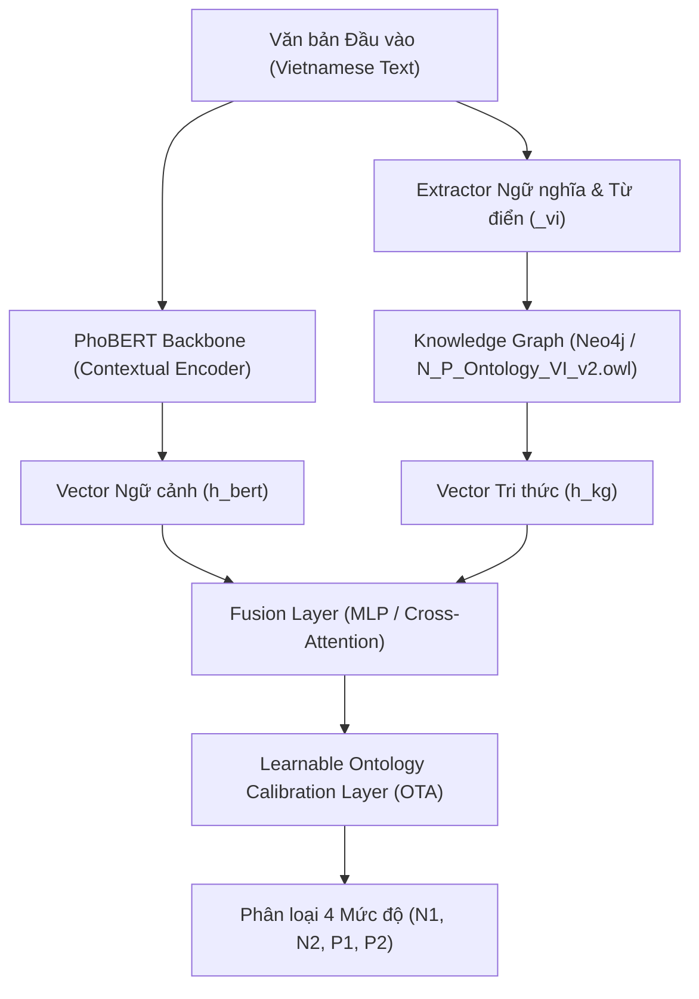

# OTA-KG / VHERA (Vietnamese Version) 🇻🇳

> **A Knowledge Graph-Enhanced Transformer Framework for Explainable Aspect-Based Sentiment Analysis in Vietnamese**


---

## 📌 Giới thiệu dự án

Dự án **OTA-KG (Phiên bản Tiếng Việt - VHERA)** là hệ thống Phân tích Cảm xúc Chi tiết (Fine-grained Sentiment Analysis) kết hợp giữa mô hình học sâu **PhoBERT (`vinai/phobert-base`)** và **Đồ thị Tri thức Ngôn ngữ học (Knowledge Graph)** dựa trên **Ontology Tiếng Việt chuẩn hóa (`N_P_Ontology_VI_v2.owl`)**.

Hệ thống hỗ trợ phân loại cảm xúc theo 4 mức độ:
- **N1** (Tiêu cực nhẹ / Tiêu cực loại 1)
- **N2** (Tiêu cực nặng / Tiêu cực loại 2)
- **P1** (Tích cực nhẹ / Tích cực loại 1)
- **P2** (Tích cực nặng / Tích cực loại 2)

---

## 🌟 Tính năng nổi bật

1. **Phân tích Cảm xúc Mịn (Fine-grained ABSA)**: Phân biệt chính xác ranh giới giữa khen/chê nhẹ và khen/chê cực đoan.
2. **Bộ Khung Ontology Tiếng Việt Chuẩn hóa (`N_P_Ontology_VI_v2.owl`)**:
   - Tương thích chuẩn W3C OWL2 với nhãn tiếng Việt (`rdfs:label xml:lang="vi"`).
   - Điểm cảm xúc tinh chỉnh chi tiết (`hasSentimentScore`: `0.95`, `0.9`, `-0.85`...).
   - Bao phủ từ vựng thực tế và từ lóng (*xịn*, *uy tín*, *đỉnh*, *tận tâm*...).
3. **Mô hình Lai PhoBERT + Knowledge Graph Fusion**:
   - Kết hợp vector ngữ cảnh từ PhoBERT với tri thức cấu trúc ngữ nghĩa từ Neo4j.
   - Cơ chế hiệu chỉnh **Learnable Ontology Calibration Layer (OTA)** giúp nâng cao F1-score và tính giải thích được (Explainability / XAI).
4. **Bộ Dữ liệu & Benchmark Tiếng Việt Chuẩn**:
   - Tập huấn luyện: `TranfomerVN.json`.
   - Từ điển tiếng Việt chuẩn hóa: `positive_vi.txt`, `negative_vi.txt`, `negation_words_vi.csv`, `words_vi.csv`.
   - Bộ kiểm thử miền máy tính/thiết bị điện tử thực tế: `Testing_VI.txt` & `ReadAcc_VI.txt`.

---

## 📁 Cấu trúc Thư mục Dự án (Updated)

```text
OTA_KG/archive/
├── OTA_KG_VI.ipynb                 # Notebook huấn luyện & đánh giá mô hình chính
├── ontology/                       # Thư mục Ontology & Neo4j Importer
│   ├── N_P_Ontology_VI_v2.owl      # File Ontology tiếng Việt v2 (Đầy đủ & chuẩn nhất)
│   ├── N_P_Ontology_VI.owl         # File Ontology tiếng Việt v1
│   └── owl_to_neo4j.py             # Script nạp Ontology & Từ điển tiếng Việt vào Neo4j KG
├── data/                           # Thư mục Dữ liệu & Dataset Loaders
│   ├── dataset.py                  # PyTorch Dataset hỗ trợ phân loại N1/N2/P1/P2
│   ├── intent/
│   │   └── TranfomerVN.json        # Dữ liệu intent huấn luyện tiếng Việt
│   ├── positive_vi.txt             # Từ điển từ tích cực tiếng Việt
│   ├── negative_vi.txt             # Từ điển từ tiêu cực tiếng Việt
│   ├── negation_words_vi.csv       # Danh sách từ phủ định tiếng Việt
│   ├── words_vi.csv                # Từ điển từ vựng tiếng Việt
│   └── kg_cache.json               # Cache đồ thị tri thức đã tính toán trước
├── TestComputer/                   # Thư mục dữ liệu kiểm thử (Benchmark)
│   └── Real_VI/
│       ├── Testing_VI.txt          # Tập test đánh giá dữ liệu thực tế
│       └── ReadAcc_VI.txt          # Tập test kiểm tra đọc accuracy
└── README.md                       # Tài liệu hướng dẫn dự án
```

---

## 🛠️ Hướng dẫn Sử dụng

### 1. Cài đặt Môi trường
Cài đặt các gói thư viện cần thiết:
```bash
pip install torch transformers sentencepiece neo4j owlready2 scikit-learn pandas numpy
```

### 2. Nạp Ontology vào Neo4j (Tùy chọn)
Nếu muốn dựng lại Knowledge Graph trên cơ sở dữ liệu Neo4j cá nhân:
```bash
python ontology/owl_to_neo4j.py
```

### 3. Huấn luyện & Đánh giá với Notebook [`OTA_KG_VI.ipynb`](file:///c:/Users/Admin/Downloads/OTA_KG/archive/OTA_KG_VI.ipynb)
Mở notebook [`OTA_KG_VI.ipynb`](file:///c:/Users/Admin/Downloads/OTA_KG/archive/OTA_KG_VI.ipynb) trên VS Code, Jupyter hoặc Kaggle và chạy lần lượt các cell:
- Cấu hình file Ontology v2:
  ```python
  OWL_FILES = [ONTOLOGY_DIR / "N_P_Ontology_VI_v2.owl"]
  ```
- Nạp bộ dữ liệu huấn luyện `TranfomerVN.json` và các từ điển `_vi`.
- Chạy huấn luyện mô hình PhoBERT + Knowledge Graph Fusion.
- Đánh giá Accuracy và F1-Score trên tập test `Testing_VI.txt`.

---

## 📊 Kiến trúc Mô hình (VHERA Architecture)


